# Assignment 2: Algorithmic Analysis, Correctness and Performance Trade-offs

## 1. Overview

This project implements and analyzes three basic data structures written in Java: a dynamic array, a singly linked list, and a binary min-heap. The dynamic array and the linked list both support add at the end, add at a given position, remove at a given position, get by position, and contains. The min-heap supports insert, peekMin, and extractMin.

The goal of the assignment is not only to implement these structures, but to prove that two of the operations are correct using loop invariants, to analyze the time and space complexity of every operation, and to measure the real performance of the structures on four fixed workloads, then compare the measurements with the theory.

## 2. Complexity Analysis

The list below gives every required operation with its best, average, and worst case time complexity, and the extra memory it needs beyond the input itself.

- Dynamic array, add at the end. Best Θ(1), average Θ(1) amortized, worst Θ(n), extra space O(1) amortized.
- Dynamic array, add at a position. Best Θ(1) when the position is the end, average Θ(n), worst Θ(n), extra space O(1).
- Dynamic array, remove at a position. Best Θ(1) when the position is the last one, average Θ(n), worst Θ(n), extra space O(1).
- Dynamic array, get by position. Best Θ(1), average Θ(1), worst Θ(1), extra space O(1).
- Dynamic array, contains. Best Ω(1), average Θ(n), worst Θ(n), extra space O(1).
- Linked list, add at the end. Best Θ(1), average Θ(1), worst Θ(1), extra space O(1). A pointer to the last node is kept, so appending never has to walk the list.
- Linked list, add at a position. Best Θ(1) when the position is the front, average Θ(n), worst Θ(n), extra space O(1).
- Linked list, remove at a position. Best Θ(1) when the position is the front, average Θ(n), worst Θ(n), extra space O(1).
- Linked list, get by position. Best Θ(1) when the position is the front, average Θ(n), worst Θ(n), extra space O(1).
- Linked list, contains. Best Ω(1), average Θ(n), worst Θ(n), extra space O(1).
- Min-heap, insert. Best Θ(1) when the new value does not need to move, average Θ(log n), worst Θ(log n), extra space O(1) amortized.
- Min-heap, peekMin. Best Θ(1), average Θ(1), worst Θ(1), extra space O(1).
- Min-heap, extractMin. Best Θ(1) when the heap becomes empty or the replaced root does not need to move, average Θ(log n), worst Θ(log n), extra space O(1).

Short justification for each row.

Dynamic array add at the end is normally a single write, but once every doubling it has to copy the whole array into a bigger one, which costs Θ(n). Averaged over many additions this copying adds only a constant amount of work per addition, so the amortized cost is Θ(1).

Dynamic array add and remove at a position depend on how many elements sit after that position, because they all have to shift by one. Adding or removing at the very end needs no shifting, adding or removing at the front needs to shift everything.

Dynamic array get by position is a direct read from an array cell, so it never depends on the size of the array.

Linked list add at the end is Θ(1) here because a pointer to the last node is kept and updated on every change. Without that pointer it would be Θ(n), since the list would have to be walked from the head every time.

Linked list add, remove, and get by position all need to walk from the head, so their cost depends on how close the position is to the front.

Both structures make the same kind of comparisons inside contains, one comparison per element until a match is found or the end is reached, so their comparison counts are equal. Their running time can still differ because of how the data is laid out in memory, which is discussed later.

Min-heap insert places the new value at the end of the array and then moves it up toward the root while it is smaller than its parent. A complete binary tree with n nodes has height about log two of n, so the value can move at most that many levels.

Min-heap extractMin moves the last value into the root and then moves it down toward the smaller of its two children until it fits. This also takes at most about log two of n steps.

An important difference to note. Get by position looks like the same operation for both structures, but the dynamic array answers instantly while the linked list has to walk the list. This difference is exactly what the first workload measures.

## 3. Correctness

Two operations were chosen for a full loop invariant proof, adding an element at a given position in the dynamic array, and moving an element down the heap during extractMin.

### 3.1 Dynamic array, add at a position

The relevant loop is the one that shifts elements to the right to make room for the new value: for i going from size down to index plus one, set data at i equal to data at i minus one.

Call data zero the state of the array right before this loop starts.

Loop invariant. Before each iteration of the loop, for the current value of i, every position from zero up to i still holds its original value from data zero, and every position from i, exclusive, up to size still holds the value that used to be one position to its left in data zero, in other words it has already been shifted one step to the right.

Initialization. Before the first iteration, i equals size. The second part of the invariant covers an empty range in this case, and the first part says every position from zero up to size still holds its original value, which is true because the loop has not run yet.

Maintenance. Assume the invariant holds for the current i, with i greater than index. The loop body copies the value from position i minus one into position i. By the invariant, position i minus one still holds its original value from data zero. After the copy, position i holds that value, and i is then decreased by one. Checking the invariant for the new, smaller i, positions from zero up to the new i were not touched this iteration, so they still hold their original values. Position i, the old i, now just above the new i, holds the value that was copied, which matches the required shifted form. Positions above the old i already satisfied the shifted form before this iteration and were not changed. So the invariant holds again after the iteration.

Termination. The loop stops when i equals index. At that point, by the invariant, positions zero up to index still hold their original values, and positions after index up to size hold the values from data zero shifted one place to the right. This means position index is now free of its old value. After the loop, the method writes the new value into position index and increases size by one. The final array therefore has the untouched prefix, the new value exactly where it was asked to go, and the rest of the original array shifted one place to the right with nothing lost or duplicated. This is exactly what inserting a value at that position should produce, so the method is correct.

### 3.2 Min-heap, moving a value down during extractMin

The relevant loop repeatedly compares a node with its two children and swaps it with the smaller child if needed. While true, find the two children of i, find the smallest among i and its existing children, if that smallest one is i then stop, otherwise swap i with the smallest child and continue with i set to that child's position.

Loop invariant. Before each iteration, for the current value of i, the two subtrees rooted at the children of i, if they exist, are each a valid min-heap on their own, and the only node in the whole subtree rooted at i that might still be out of place is the node currently sitting at position i itself.

Initialization. Before the first iteration, i is the root, where extractMin has just placed the value that used to be the last element of the heap. The two subtrees under the root were valid min-heaps before this happened and were not touched by placing the new value at the root, so they are still valid. The only node that might be out of place is the one just placed at the root, which matches the invariant.

Maintenance. Assume the invariant holds for the current i. The method compares the value at i with its children, if any, and finds the smallest among them.

If the smallest is i itself, the value at i is already not larger than either child, and since both children are roots of valid heaps by the invariant, the whole subtree rooted at i is now a valid heap with no node out of place. The loop stops here, which matches the case described in the invariant.

If the smallest is one of the children, say the left child, the method swaps the values at i and at the left child. The value that used to be at the left child is not larger than the value that used to be at the right child, since it was chosen as the smallest of the three, so after the swap the new value at i is not larger than either child, and it came from a subtree that was already a valid heap, so it is not larger than anything below the left child either. The subtree under the right child was not touched and stays valid. The value that moved down to the left child's position is the one that might now be too large for its own children, since it has not been compared with them yet, which is exactly the single possibly out of place node the invariant expects at the new position, namely the left child. So the invariant holds again with i now equal to the left child's position.

Termination. The loop can only end through the branch where the smallest value among i and its children is already at i, which was shown above to mean the whole subtree rooted at the original i has become a valid heap with nothing left out of place. Since extractMin calls this procedure starting from the root of the whole heap, and the rest of the array outside this subtree was a valid heap before the call and was never touched, the entire heap satisfies the min-heap property once the loop ends. This proves that extractMin correctly restores the heap after removing the minimum.

## 4. Experimental Setup

Java 25 with Maven and JUnit 5 was used, on Windows.

Sizes used for n, wherever applicable, are 100, 1,000, 10,000, and 100,000.

The value m, the number of operations performed during a workload, is fixed per workload: 10,000 lookups in workload one, 1,000 searches in workload two, 1,000 insertions and up to 1,000 removals in workload three (for n equal to 100 the number of removals is capped at n, since there are not 1,000 elements left to remove from a hundred-element structure), and n insertions followed by n extractions in workload four.

Every timed measurement runs 2 untimed warm-up repetitions first, so that the JVM has a chance to compile the hot code before timing starts, then 5 timed repetitions, and the reported time is the average of those 5. Building the structure from the initial random data is never included in the timed part, only the operation being measured is timed.

Timing uses System.nanoTime, converted to milliseconds. All random data uses a fixed seed of 42, plus a small fixed offset per data set so that different workloads do not reuse the exact same sequence of numbers by accident.

The four workloads follow the assignment description exactly, random access with get, search with contains, insertion and removal at the beginning and in the middle, and priority processing with the heap.

## 5. Results

All raw numbers are stored in the results tables folder, in the file results.csv, with the columns workload, structure, n, timeMs, and metric (comparisons or movements, depending on the workload).

### Workload 1, random access

Time in milliseconds, ten thousand get calls, dynamic array versus linked list.

- n equal to 100, 0.473 and 2.160
- n equal to 1,000, 0.046 and 7.506
- n equal to 10,000, 0.066 and 84.309
- n equal to 100,000, 0.007 and 1,301.242

The dynamic array numbers stay tiny and do not grow with n, while the linked list grows roughly in proportion to n.

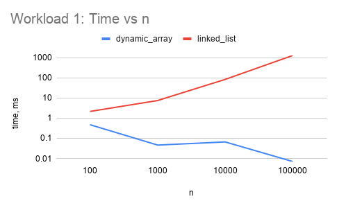

### Workload 2, search

Time in milliseconds, one thousand contains calls.

- n equal to 100, 0.258 and 0.282
- n equal to 1,000, 0.273 and 1.951
- n equal to 10,000, 1.984 and 36.473
- n equal to 100,000, 19.926 and 213.920

Number of comparisons, identical for both structures, since both scan linearly.

- n equal to 100, 100,000
- n equal to 1,000, 1,000,000
- n equal to 10,000, 9,925,648
- n equal to 100,000, 93,756,058

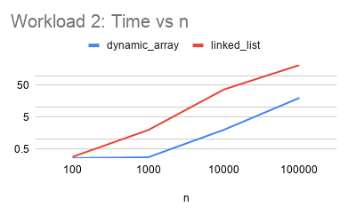

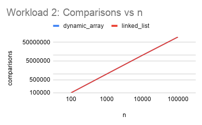

### Workload 3, insertion and removal at n equal to 100,000

Time in milliseconds, dynamic array versus linked list.

- Insert at the beginning, 9.283 and 0.032
- Insert in the middle, 4.727 and 84.026
- Remove from the beginning, 7.842 and 0.077
- Remove from the middle, 3.884 and 93.175

Element movements counted for the same four cases.

- Insert at the beginning, 100,499,500 and 0
- Insert in the middle, 50,499,500 and 49,999,000
- Remove from the beginning, 99,499,500 and 0
- Remove from the middle, 49,499,500 and 49,999,000

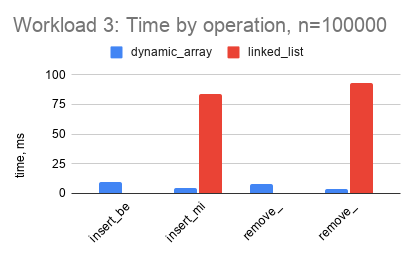

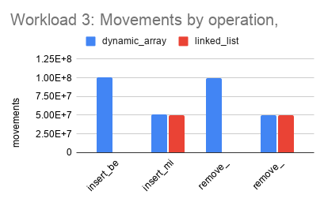

### Workload 4, priority processing with the heap

Time in milliseconds for n insertions and for n extractions.

- n equal to 100, 0.106 and 0.043
- n equal to 1,000, 0.050 and 0.131
- n equal to 10,000, 0.444 and 1.304
- n equal to 100,000, 2.318 and 10.793

Comparisons counted for the same four cases.

- n equal to 100, 206 and 848
- n equal to 1,000, 2,232 and 14,980
- n equal to 10,000, 22,779 and 216,548
- n equal to 100,000, 227,941 and 2,831,864

Every extraction returned values in non-decreasing order, which was also verified automatically by the unit tests.

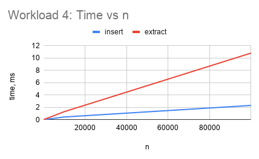

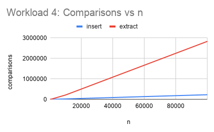

## 6. Discussion

How does increasing n affect each workload. In every workload, the dynamic array's get by position stays essentially flat, while everything that depends on walking the linked list or shifting the dynamic array grows with n. The heap's insert and extract both grow, but extract grows faster, since it always has to sift all the way down from the root, while insert on average only needs to sift up a short distance.

Which experimental results agree with the theoretical complexity. Get by position on the dynamic array stays under a millisecond regardless of n, matching constant time. The linked list's get grows in a way consistent with linear time, roughly ten times slower for each tenfold increase in n. The heap's comparison counts grow close to n times log n, at n equal to 100,000 extraction used about 2.83 million comparisons, and n times log two of n at that size is close to 1.7 million, which is the right order of magnitude given that each step of sifting down needs up to two comparisons.

Where the experimental results differ from the theoretical prediction. The dynamic array's own get by position measurements do not increase smoothly with n, for example the time at n equal to 100,000 measured lower than at n equal to 1,000. Since all of these times are a fraction of a millisecond, this is measurement noise from the JVM warming up and from the operating system scheduler, not a sign that the algorithm behaves differently. Workload three shows a similar case, dynamic array and linked list have almost identical movement counts when inserting or removing in the middle, about fifty million each, yet the dynamic array is around eighteen to twenty times faster in that case.

Why two algorithms with the same big O complexity can have different running times. Big O only counts the number of basic steps, not how expensive each step is on real hardware. Shifting elements in the dynamic array touches one contiguous block of memory, which the processor can read and write very efficiently because of caching. Walking the linked list jumps between separately allocated nodes that are scattered in memory, so each step is more likely to miss the cache, which costs far more real time per step even though the number of steps is the same.

How constant factors and implementation details affect performance. The shifting in the dynamic array and the pointer following in the linked list both look like a single line of code, but the constant work behind that line is very different, an array write is one memory access, while following a node reference and then reading its value is at least two, and those two are less likely to be nearby in memory. This is why constant factors, not just the leading term, decide which structure is faster for a specific workload.

Why a dynamic array is preferable for some workloads. Whenever positions are accessed by index, or whenever elements need to be added or removed mainly at the end, the dynamic array is both simple and fast, since it never needs to walk anything to reach a position, and appending is amortized constant time.

When a linked list can be useful. When insertions and removals happen mainly at the front, or when the position being changed is already known through a reference to it rather than through an index, the linked list needs no shifting at all, which the results confirm, inserting and removing at the beginning cost close to zero for the linked list while costing the most for the dynamic array.

Why a heap is appropriate for priority based processing. A heap keeps the smallest element easy to find in constant time while keeping both insertion and removal of the minimum at logarithmic time, which is far cheaper than keeping the whole collection sorted after every change. This makes it the natural fit whenever the next task to work on is always the one with the smallest priority value.

How the workload influences the choice of data structure. The same two structures can trade places depending entirely on what operation dominates the workload, the dynamic array wins for random access and for changes near the end, the linked list wins for repeated changes near the front, and neither is a good fit once repeated priority based selection is required, which is where the heap belongs.

## 7. Design Recommendations

For a workload dominated by random access through get by position, the dynamic array is the right choice, since its access time does not depend on n.

For a workload dominated by search through contains, either structure gives the same number of comparisons, so the choice can be based on other operations that workload also needs.

For a workload dominated by insertions and removals near the front, the linked list is the right choice, since those operations cost nothing beyond following one pointer.

For a workload dominated by insertions and removals near the end, the dynamic array, with its amortized constant time appends, is the right choice.

For a workload dominated by insertions and removals in the middle at arbitrary positions, both structures pay a similar price in principle, but the dynamic array tends to be faster in practice because of how it uses memory, as shown in workload three.

For a workload that repeatedly needs the current smallest value out of a changing collection, the min-heap is the right choice, since it is built exactly for that purpose and both operations it offers for this stay logarithmic.

## 8. Conclusion

The dynamic array and the linked list implement the same five operations but with very different costs depending on where in the structure the operation happens, the dynamic array is fastest when working with fixed positions or the end of the structure, and the linked list is fastest when working at the front. The measured results agreed with the expected complexities in almost every case, with the small exceptions explained by JVM warm-up noise on very short operations. The min-heap kept both insertion and extraction close to logarithmic time even at one hundred thousand elements, confirming that it is the appropriate structure whenever repeated access to the current minimum is needed. Overall, no single structure is best for every workload, and the right choice depends on which operations that workload performs most often.

## Screenshots

Program output:

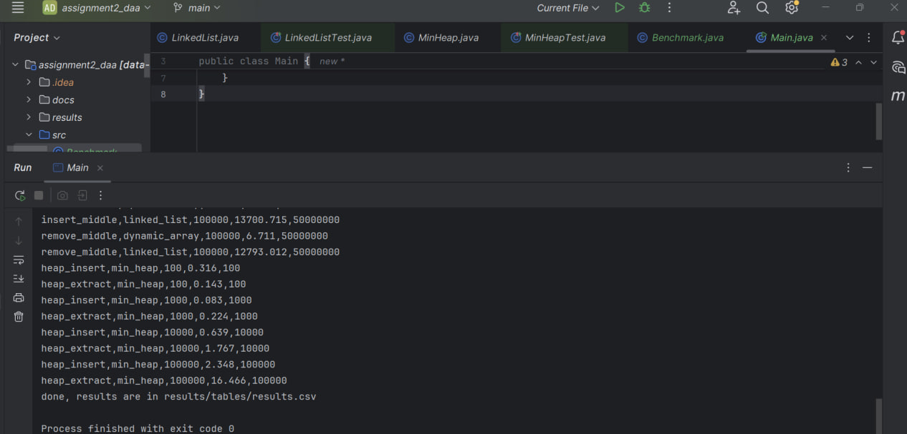

All tests passing:

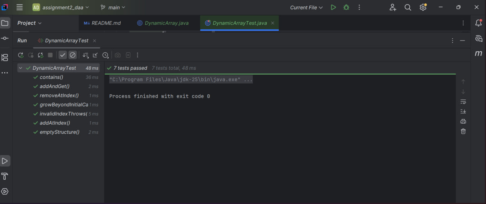
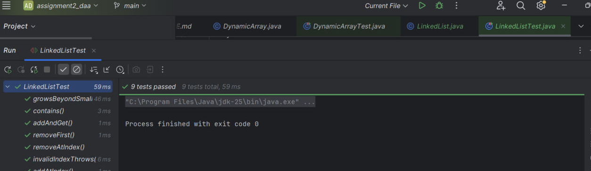
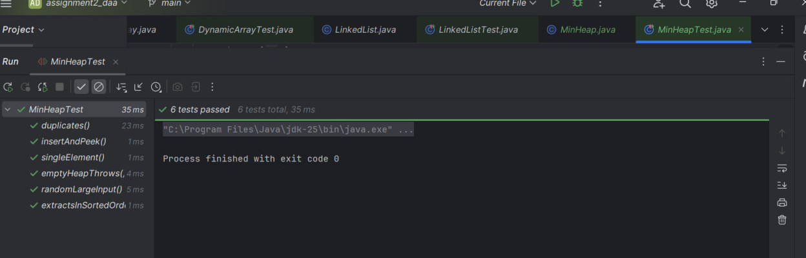

Workload 1 table and chart:

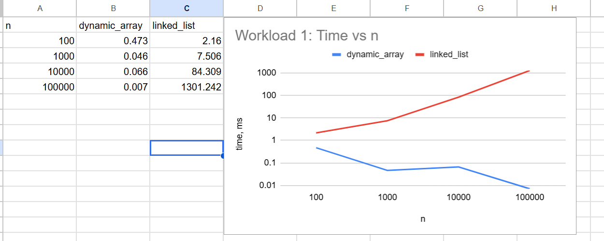

Workload 2 tables and charts:

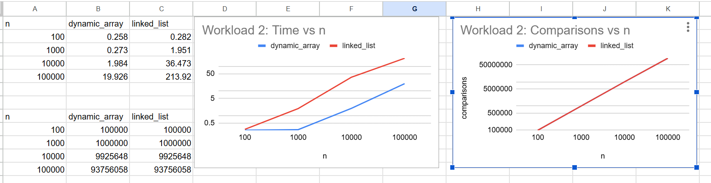

Workload 3 tables and charts:

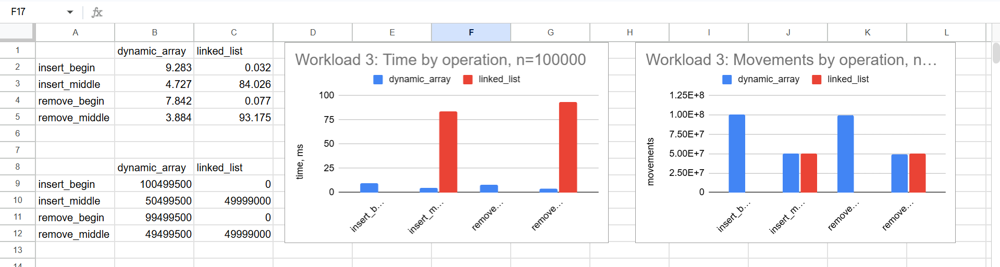

Workload 4 tables and charts:

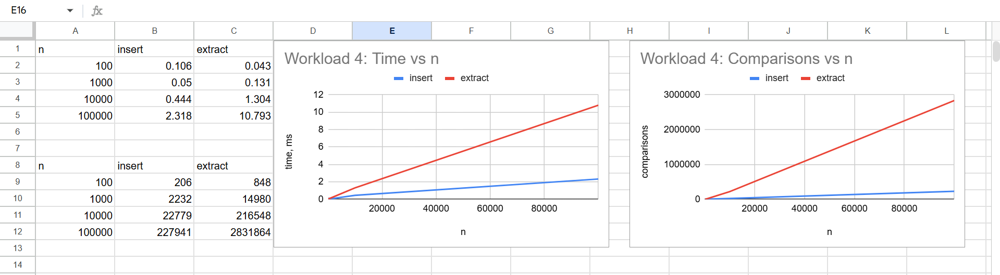

## Project files

- src holds DynamicArray.java, LinkedList.java, MinHeap.java, Benchmark.java, and Main.java.
- tests holds DynamicArrayTest.java, LinkedListTest.java, and MinHeapTest.java.
- results holds tables (results.csv) and plots (the eight chart images referenced above).
- docs holds screenshots of the program output, the test runs, and the benchmark tables and charts.
- README.md, pom.xml, and .gitignore sit in the project root.